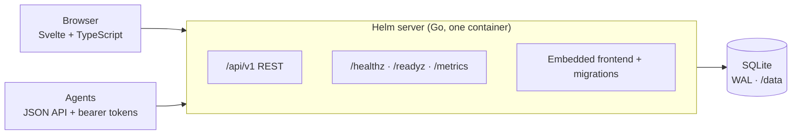

<div align="center">

<picture>
  <source media="(prefers-color-scheme: dark)" srcset="docs/assets/hero-dark.svg">
  
</picture>

<br>

**A small, self-hosted project board and bug tracker for teams where humans and software agents move work together.**

[](https://github.com/KanterLabs/helm/actions/workflows/ci.yml)


[Quick start](#quick-start) ·
[Features](#features) ·
[Agents](#agents) ·
[Configuration](#configuration) ·
[Docs](#docs) ·
[Development](#development)

</div>

---

Humans get a focused Kanban workspace. Agents get a stable, auditable API for
discovering, claiming, updating, and finishing tasks, without sharing a human
login. Both use the same versioned API, and everything runs as one unprivileged
container backed by SQLite.

Helm deliberately keeps its model small: one board per project, ordered
semantic columns, and a single database file. It is not a Trello-compatible API
or a full team-suite replacement.

<a id="quick-start"></a>

## 🚀 Quick start

You need Docker Engine with the Compose plugin.

```sh
git clone https://github.com/KanterLabs/helm.git && cd helm
docker compose up --build --detach
curl --fail http://127.0.0.1:8080/healthz
```

Open <http://localhost:8080> and create the local administrator on the setup
screen. The default stack binds to `127.0.0.1:8080`, seeds demo data, and keeps
everything in the persistent `roadmap-data` volume.

<details>
<summary>Start empty, stop, or reset</summary>

```sh
HELM_DEMO_SEED=false docker compose up --build --detach   # no demo data
docker compose down                                        # stop
docker compose down -v                                     # stop AND delete all data
```

</details>

<a id="features"></a>

## ✨ Features

<table>
<tr>
<td width="50%" valign="top">

### 🗂️ Boards that stay out of the way
Backlog, Ready, In progress, Blocked, and Done columns. Drag-and-drop or
keyboard moves, fast task creation, and filters for state, kind, priority,
severity, label, assignee, focus, and agent state. `Cmd/Ctrl+K` switches
projects.

</td>
<td width="50%" valign="top">

### 🤖 Agents as first-class teammates
Agents get their own identities and project-scoped bearer tokens. Leased
claims, live progress updates, and a cursor-based event feed show you what
every agent is doing, with nothing shared through a human login.

</td>
</tr>
<tr>
<td valign="top">

### 🐞 A built-in bug tracker
Bugs record actual vs. expected behavior, reproduction steps, environment, and
affected version. Triage by severity (`s1`–`s4`), resolve with a reason, and
reopen when a regression returns.

</td>
<td valign="top">

### 🎯 Focus and roadmap
Group the tasks that matter now into a Focus with an optional target date and
readiness tracking. **My work**, **Live Work**, and **Roadmap** views show
assignments, agent progress, deadlines, and recent activity across projects.

</td>
</tr>
<tr>
<td valign="top">

### 🔍 Guarded board audits
Run read-only audits, review immutable findings, and preview recommendations
before applying them. Nothing moves until someone explicitly confirms it.

</td>
<td valign="top">

### 🔒 Secure by default
Read-only root filesystem, no Linux capabilities, loopback-only port binding,
and hashed tokens that are shown only once. Supports local accounts,
Cloudflare Access, or private Tailnet authentication.

</td>
</tr>
</table>

You also get Markdown descriptions, comments, labels, due dates, watches with
deduplicated in-app notifications, portable export/import between
installations, and a responsive UI that works on mobile, with keyboard
navigation and screen-reader support.

<a id="agents"></a>

## 🤖 Built for agents

<picture>
  <source media="(prefers-color-scheme: dark)" srcset="docs/assets/agent-loop-dark.svg">
  
</picture>

An administrator creates an agent, then issues a token from **Settings** or
`POST /api/v1/agents/{agent}/tokens`:

```sh
export HELM_TOKEN='store-this-in-your-secret-manager'
curl --fail -H "Authorization: Bearer ${HELM_TOKEN}" \
  http://127.0.0.1:8080/api/v1/projects
```

| Scope | Grants |
| --- | --- |
| `projects:read` / `projects:write` | Read or manage projects |
| `tasks:read` / `tasks:write` | Read or edit tasks, bugs, Focus, and audits |
| `tasks:claim` | Claim, renew, release, and complete work |
| `events:read` | Follow the event feed |

An agent's project list is a ceiling: each token can narrow it but never widen
it. Every mutation uses optimistic concurrency (`ETag` / `If-Match`) and
idempotency keys, so retries are safe. Claimed tasks show a live progress
indicator on the board, and one that hasn't updated in 15 minutes is marked
stale.

**Codex skill:** the installable [`helm` skill](skills/helm/SKILL.md) makes Helm
the durable work record for coding agents. Install it from
`KanterLabs/helm/tree/main/skills/helm` with Codex's skill installer. See
[the skill docs](skills/helm/SKILL.md) for lifecycle hooks and
[authentication](skills/helm/references/authentication.md).

## 🏗️ Architecture



The only writable path is the `/data` volume, which holds the database and
configuration.

<a id="configuration"></a>

## ⚙️ Configuration

`HELM_*` variables are the current names. The older `ROADMAP_*` aliases still
work; if both are set to different values, Helm refuses to start.

| Variable | Default (Compose) | Purpose |
| --- | --- | --- |
| `HELM_AUTH_MODE` | `local` | `local`, `cloudflare`, `tailnet`, or `disabled` (dev only) |
| `HELM_PUBLIC_ORIGIN` | `http://localhost:8080` | External URL users reach Helm at |
| `HELM_SECURE_COOKIES` | `false` | Set `true` behind HTTPS |
| `HELM_DEMO_SEED` | `true` | Seed demo projects on first start |
| `HELM_ADMIN_EMAIL` | — | Administrator identity for SSO modes |
| `HELM_ADDR` | `0.0.0.0:8080` | Listen address inside the container |
| `HELM_DB` | `/data/roadmap.db` | SQLite database path |
| `HELM_LUNA_ENABLED` | `true` | Task assist via each user's own Codex subscription |

<details>
<summary>Authentication modes</summary>

- **`local`**: the first-run setup creates an administrator, and users sign in
  with email and password.
- **`cloudflare`**: verifies Cloudflare Access identity assertions. Set
  `HELM_CLOUDFLARE_ISSUER` and `HELM_CF_ACCESS_AUDIENCES` (the UI and API AUD
  tags). `HELM_CLOUDFLARE_JWKS_URL` is optional.
- **`tailnet`**: private-only. A trusted edge sends a short-lived,
  request-bound assertion. Configure `HELM_TAILNET_OWNER_LOGIN`,
  `HELM_ADMIN_EMAIL`, the private origin and audience, an assertion key, TLS
  files, and the edge peer allowlist.
- **`disabled`**: bypasses authentication for development. Never use it on a
  reachable deployment.

</details>

<details>
<summary>Codex task assist</summary>

Each signed-in user can connect their own Codex-enabled ChatGPT subscription
from **Settings → Your Codex subscription** with the device-code flow, which
also works on headless servers. Credentials stay in per-user directories under
`/data/codex-users`, and Helm never shares a host API key between users. Set
`HELM_LUNA_ENABLED=false` and restart to turn it off. See
[`docs/LUNA_TASK_ASSIST.md`](docs/LUNA_TASK_ASSIST.md).

</details>

<a id="docs"></a>

## 📚 Documentation

| Topic | Doc |
| --- | --- |
| Full API contract | [`docs/API_CONTRACT.md`](docs/API_CONTRACT.md) · [`openapi.yaml`](openapi.yaml) (served at `/openapi.json`) |
| Focus, bug, live-work, and audit workflows | [`docs/AGENT_WORKFLOWS.md`](docs/AGENT_WORKFLOWS.md) |
| Notifications and watches | [`docs/NOTIFICATIONS.md`](docs/NOTIFICATIONS.md) |
| Moving data between installations | [`docs/PORTABILITY.md`](docs/PORTABILITY.md) |
| Metrics, readiness, and logs | [`docs/OBSERVABILITY.md`](docs/OBSERVABILITY.md) |
| Installable PWA | [`docs/PWA.md`](docs/PWA.md) |
| Operations, backups, and restore | [`docs/OPERATIONS.md`](docs/OPERATIONS.md) |
| How the maintainers deploy Helm | [`docs/HOMELAB_DEPLOYMENT.md`](docs/HOMELAB_DEPLOYMENT.md) |

<a id="development"></a>

## 🛠️ Development

```sh
make build          # npm ci, frontend check/test/build, embed assets, Go build
make test vet lint  # Go checks
make web-check web-test
make openapi        # regenerate openapi.json after editing openapi.yaml
make openapi-check
```

For frontend-only work, run `cd web && npm ci && npm run dev`. The Playwright
suite (`npm run e2e`) expects a server at `http://127.0.0.1:18080`; install its
browser once with `npm run e2e:install`. [`ci.yml`](.github/workflows/ci.yml)
shows the full disposable-server setup.

---

<div align="center">
<sub>Built by <a href="https://github.com/KanterLabs">KanterLabs</a>.</sub>
</div>
